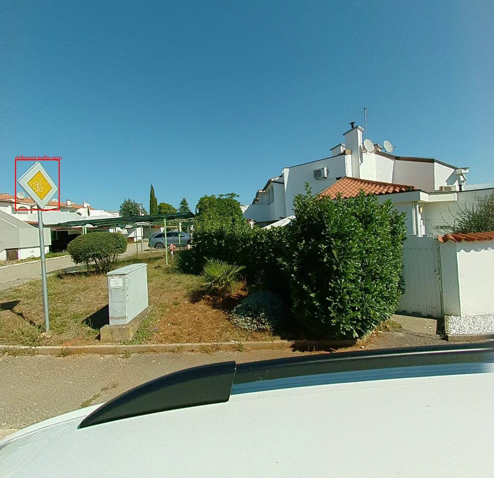
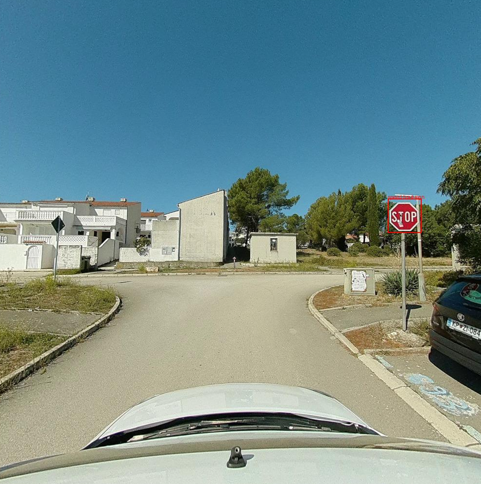
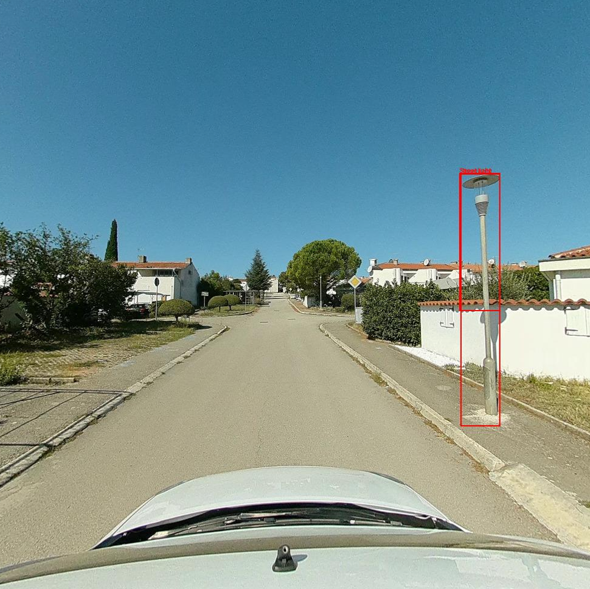
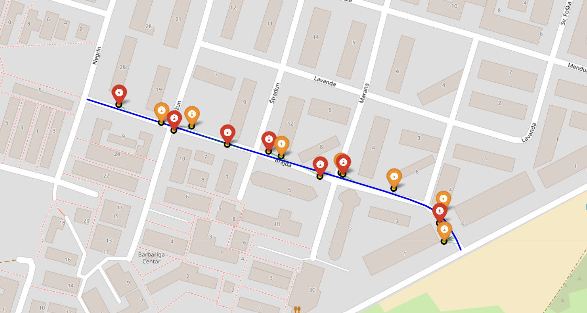
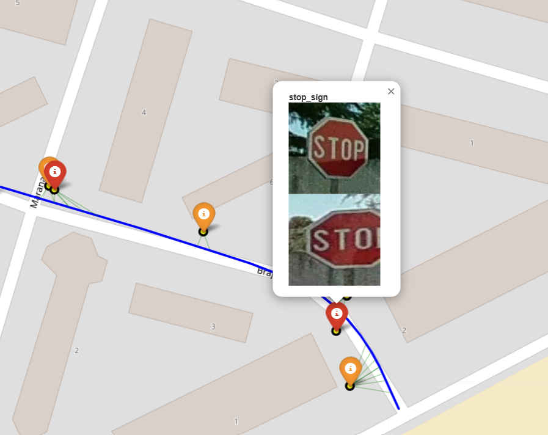

# Geogrupa TBI - AI Geospatial Object Mapping System

This project is an AI prototype system for detecting and localizing objects from georeferenced 360° videos. The system identifies:

1. **Traffic signs**
2. **Street lighting poles**

The system processes 360° video files to extract frames, detect objects using YOLO models, classify traffic signs using OpenAI's vision models, and triangulate object positions to create interactive maps with precise coordinates.





## Prerequisites

- Python >=3.11
- [uv](https://github.com/astral-sh/uv) package manager
- OpenAI API key (for traffic sign classification)

## Setup

1. **Set up environment variables:**
   Copy the `.env.example` file to a new file named `.env`.

   For Windows (PowerShell):
   ```powershell
   Copy-Item .env.example .env
   ```

   For macOS / Linux:
   ```bash
   cp .env.example .env
   ```
   
   Add your OpenAI API key to the `.env` file:
   ```env
   OPENAI_API_KEY="your_openai_api_key_here"
   ```

1. **Install dependencies:**
   Dependencies will be automatically installed when running the project with `uv run`.

## Running the project

### Main processing pipeline

To process a 360° video file and detect objects, run the main script with the video file path:

```powershell
uv run main.py <video_file_path>
```

**Example:**
```powershell
uv run main.py 220919_111512835.mp4
```

This will:
1. Extract image frames from the video
2. Extract telemetry data (GPS coordinates, heading)
3. Run object detection using YOLO models
4. Classify detected traffic signs using OpenAI
5. Triangulate object positions and create an interactive map




### Additional utilities

**View extracted dataset:**
```powershell
uv run view_dataset.py
```

**Visualize detection predictions:**
```powershell
uv run visualize_predictions.py
```

## Models used

* `yolov8s-traffic-sign.pt` - Traffic sign detection model from [road_detection_model](https://github.com/Mkoek213/road_detection_model/tree/main/road_detection_model/Models)
* `yolov8n-oiv7.pt` - General object detection model from [Ultralytics Open Images V7](https://docs.ultralytics.com/datasets/detect/open-images-v7/#open-images-v7-pretrained-models)

## Output

The system generates:
- Extracted image frames with telemetry data
- Object detection results with bounding boxes
- Traffic sign classifications
- Interactive HTML map with triangulated object positions
- JSON files with detection and location data

## Traffic signs reference

Croatian road signs: https://en.wikipedia.org/wiki/Road_signs_in_Croatia
